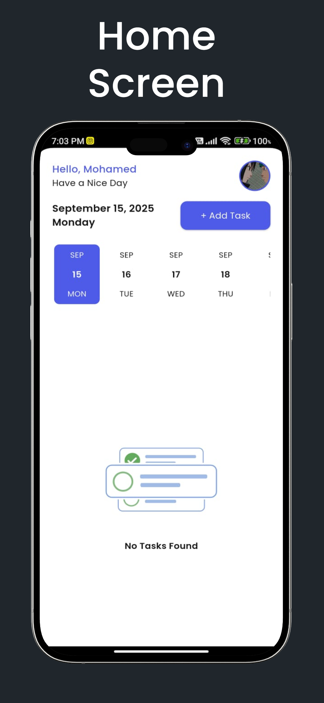
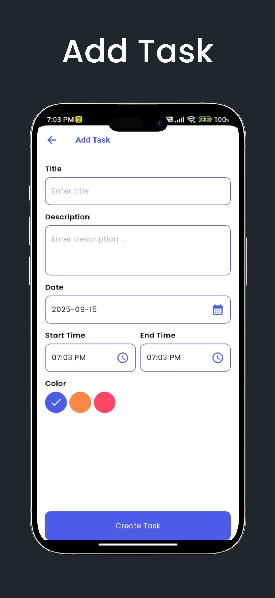
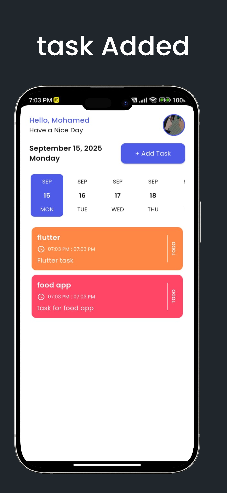
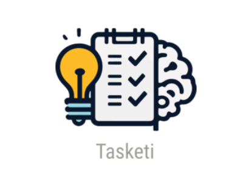

# 📒 Tasketi — Notes App  

**Tasketi** is a simple yet powerful Flutter application for writing and organizing notes.  
It is built with **clean code principles**, **Hive local storage**, and supports both **Light & Dark themes**.  

---

## ✨ Features  
- Create, edit, and delete notes.  
- Offline storage with **Hive database**.  
- **TypeAdapters** for custom data models.  
- Light & Dark **themes**.  
- Add images to notes using the device gallery.  
- Beautiful **Lottie animations**.  
- Date selection using **Date Picker Timeline**.  
- Internationalization & date formatting with **Intl**.  
- Custom **Poppins** font family.  
- Modern UI with **Hive widgets** & clean structure.  

---

## 📦 Dependencies Used  
- **flutter**  
- **gap**  
- **lottie**  
- **image_picker**  
- **hive**  
- **hive_flutter**  
- **intl**  
- **date_picker_timeline**  

**Dev Dependencies**  
- **flutter_lints**  
- **flutter_test**  
- **hive_generator**  
- **build_runner**  
- **flutter_launcher_icons**  

---

## 🖼️ Screenshots  

|Splah Screenn | Home screen | Add Task | Task Added| Profile Screen |
|-------------|-----------|--------------|----------|----------|
|  |  |  |  |  |

---

## 📱 Full App Preview  

  

---

## 🎨 Fonts & Assets  
- **Font Family:** Poppins (Regular, Medium, SemiBold, Bold)  
- **Assets:** Logo + images for UI  

---

## 🚀 How It Works  
1. Data is stored locally using **Hive**.  
2. Each note is saved as a model with a generated **TypeAdapter**.  
3. The UI listens to Hive boxes with **Hive widgets** for real-time updates.  
4. Notes can include text, creation date, and an optional image.  

---

## 📱 App Icon  
Customized launcher icon generated with **flutter_launcher_icons**.  
